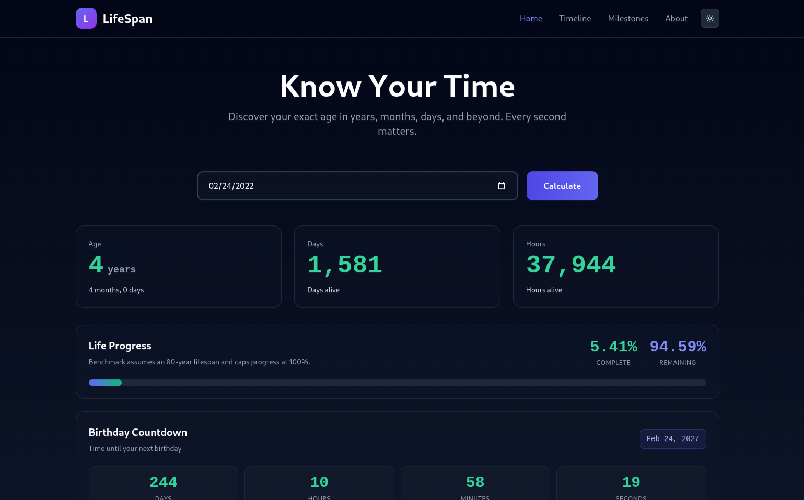

# LifeSpan — Know Your Time

> *Every second is a stat. Make it count.*

---



## The Challenge It Solves

People Google "how many days have I been alive" and "what day was I born" millions of times a month. Every result that ranks is a 2009-era tool with ads, low contrast, no mobile layout, and zero personality. LifeSpan is the answer those searches deserve — production-quality, instantly shareable, and genuinely useful beyond a single number.

---

## Features

- Precise age in years, months, and days with animated counter reveal
- Total time lived: days, weeks, months, hours — all computed live
- Life progress bar benchmarked to 80 years
- Biological estimates: heartbeats, breaths taken, time spent sleeping
- Day-of-week birth fact
- Age milestone timeline (18, 21, 25, 30, 40, 50, 60, 70) with past/upcoming/future badges
- Live birthday countdown with ticking seconds
- Shareable URL per birth date (e.g. `/age/1990-05-14`)
- Responsive, mobile-first layout
- Zero dependencies on the client

---

## Tech Stack

| Layer | Choice | Reason |
|---|---|---|
| Framework | Next.js (App Router) | Edge-ready, file-based routing, RSC for zero-JS server pages |
| Styling | Tailwind CSS | Utility-first, no runtime |
| Date logic | Pure JS / `date-fns` | No heavy libs; date-fns tree-shakes well |
| Deployment | Vercel | Edge functions, OG image generation at the CDN edge |
| OG Images | `@vercel/og` | Dynamic share cards per birth date, generated serverlessly |
| Analytics | Plausible | Privacy-first, no GDPR headache |

---

## Getting Started

```bash
# Clone
git clone https://github.com/your-org/lifespan
cd lifespan

# Install
npm install

# Dev server
npm run dev

# Build
npm run build
```

Open [http://localhost:3000](http://localhost:3000).

---

## Shareable URLs

Each calculated result lives at a permanent URL:

```
https://lifespan.app/age/1990-05-14
```

This page generates a dynamic Open Graph image on the fly showing the person's age stats — making it share-worthy on Twitter/X, WhatsApp, and LinkedIn without any user action beyond copying the URL.

---

## Contributing

PRs welcome. Please open an issue first for anything beyond bug fixes. Keep the zero-dependency client constraint — no heavy date libraries in the browser bundle.

*Built by developers who think age is just a really interesting dataset.*
